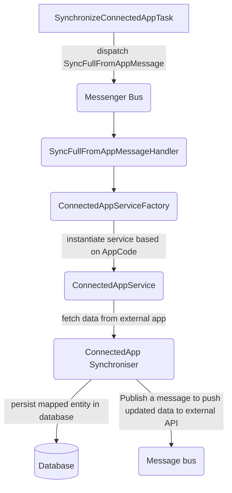

# Connected Apps Overview

This module handles integrations with external applications (SoftMouse, Fair3R, ...). Each external system is represented by a `ConnectedApp` entity identified by an `AppCode` enum value. Services implementing the synchronization logic are auto‑discovered through dependency injection.

## Service Interfaces
- **`ConnectedAppServiceInterface`** – base contract used by the factory to pick the correct service for a given `AppCode`.
- **`ConnectedAppFromInterface`** – implemented when the app can **send data to MAPP** (synchronization *from* the external app). It defines methods like `syncAllFromExternal()` and `syncOneFromExternal()`.
- **`ConnectedAppToInterface`** – implemented when MAPP can **push data to the external app**. It exposes methods such as `syncAllToExternal()` and `syncOneToExternal()`.

All connected app services are tagged with `app.connected_app_service` so that `ConnectedAppServiceFactory` can retrieve them via a tagged iterator.

## Message Handlers
Synchronization is performed asynchronously using Symfony Messenger messages:
- `SyncFullFromAppMessageHandler` – triggers a full import from one connected app.
- `SyncAllFromAppMessageHandler` – imports all entities of a given class for a user.
- `SyncOneFromAppMessageHandler` – imports a single entity for a user.
- `SyncOneToAppMessageHandler` – pushes one entity to every other connected app of the user.

Handlers obtain the appropriate service through `ConnectedAppServiceFactory` and call the interfaces above.

## Scheduler
`SynchronizeConnectedAppTask` runs as a cron task and dispatches `SyncFullFromAppMessage` for every app needing a sync. The messages are then processed by the handlers described above.

## Adding a New Connected App
1. **Extend the enum** – add your application code in [`AppCode`](../Enum/AppCode.php).
2. **Create a service** implementing `ConnectedAppServiceInterface` and optionally `ConnectedAppFromInterface`/`ConnectedAppToInterface`.
3. **Register the service** in `services.yaml` with the tag `app.connected_app_service` so it is picked up by `ConnectedAppServiceFactory`.
4. Implement synchronizers, mappers and other specifics as needed. Once registered, the generic message handlers and scheduler will automatically use your service.
